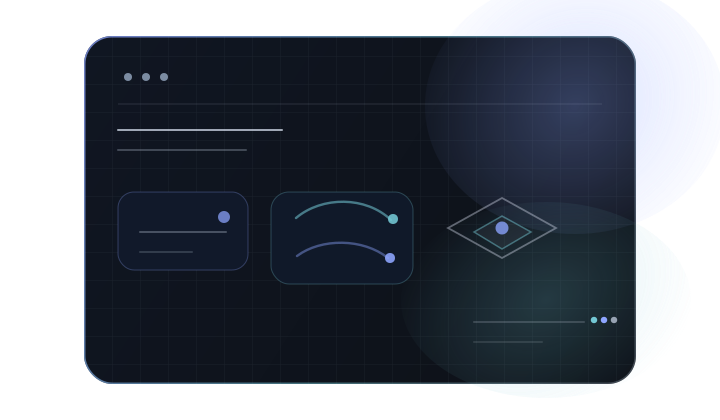
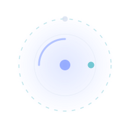

<h1>zheng13</h1>

<table>
<tr>
<td width="56%" valign="top">

## about

- 这里主要放项目、实验、草稿，以及一些还在施工中的东西。
- 有些仓库是结果，有些仓库更像过程记录。
- 如果某个仓库看起来有点乱，通常不是弃坑，更可能是它还在继续，所以暂时还没收拾。

</td>
<td width="44%" align="right" valign="top">
  
</td>
</tr>
</table>

  

## toolbox

**build**

  
  
  
  
  

**ship**

  
  
  
  
  

  平时主要和这些打交道。 

  

